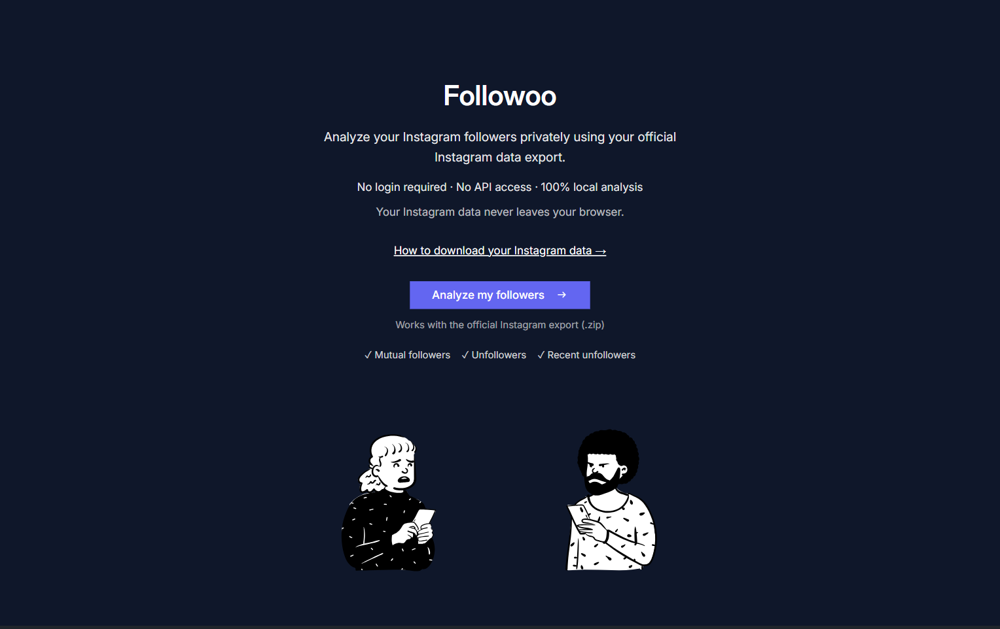
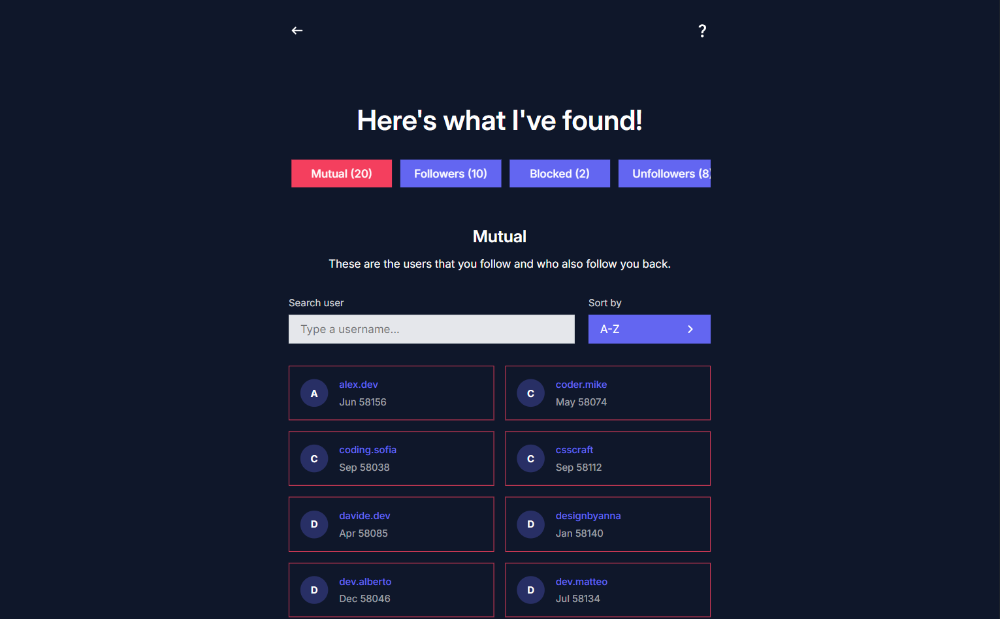
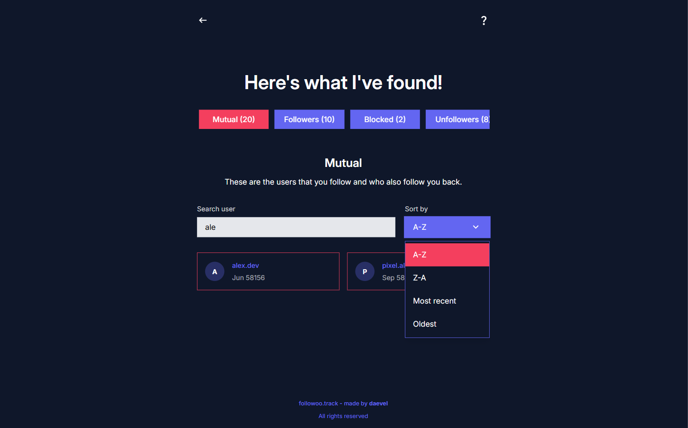
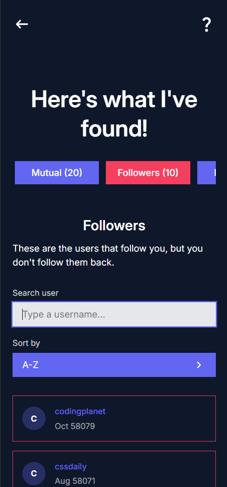
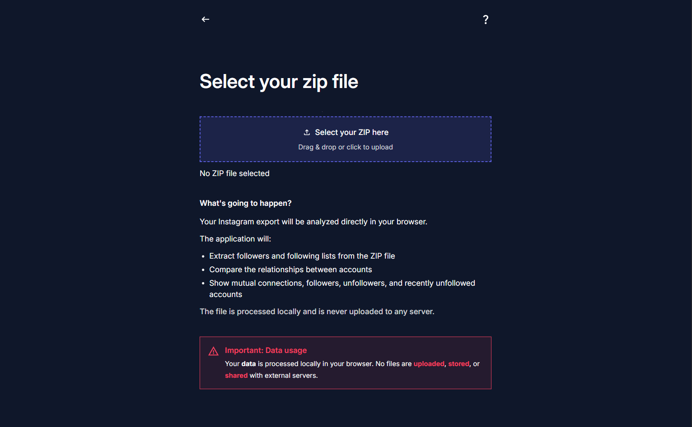

# Followoo


Analyze your Instagram followers and relationships using your official Instagram data export.



Followoo is a privacy-focused tool that allows you to analyze your Instagram relationships directly in the browser using the ZIP file provided by Instagram’s official data export.

No login. No API access. No data storage.

All analysis happens locally in your browser.

---

## ✨ Features

Followoo provides a set of tools to understand your Instagram connections more clearly:

• **Mutual connections**  
See users that you follow and who follow you back.

• **Followers**  
Identify accounts that follow you but you don't follow back.

• **Unfollowers**  
Detect accounts you follow that do not follow you.

• **Recent unfollowers**  
View accounts that recently unfollowed you (based on export data).

• **Blocked users**  
List the users you have blocked.

• **Search and filtering**  
Quickly find users using the search bar.

• **Advanced sorting**

- Alphabetical
- Most recent
- Oldest

• **Fully client-side**
All data processing happens locally in your browser.

---

## 🔒 Privacy First

Followoo is built with privacy as a core principle.

• No login required  
• No Instagram API access  
• No user tracking  
• No file uploads to servers  
• No data storage

Your Instagram export file is processed **entirely inside your browser session**.

Once the page is refreshed or closed, the data disappears.

---

## 🖼️ Screenshots

### Results Overview



### Search and Sorting



### Mobile Experience



### Upload ZIP



---

## 🎥 Demo


---

## 🧠 How it Works

Followoo analyzes your Instagram relationships using the official export files.

The workflow is simple:

1. Request your Instagram data export
2. Download the ZIP file
3. Upload the ZIP file to Followoo
4. The app extracts the required JSON files
5. Relationships are analyzed
6. Results are displayed instantly

All of this happens **locally in the browser**.

---

## 📦 Supported Instagram Export Structure

Followoo expects the standard structure provided by Instagram's export.

```text
connections/
└── followers_and_following/
    ├── followers_1.json
    ├── following.json
    ├── recently_unfollowed_profiles.json
    └── blocked_profiles.json
```
These files are extracted from the ZIP and analyzed to determine relationship status.


---

## 🚀 Getting Started

### 1. Clone the repository

```bash
git clone https://github.com/daevel/followoo.git
cd followoo
```

### 2. Install dependencies

```bash
npm install
```

### 3. Start development server

```bash
npm run dev
```

### URL

```bash
Open the application at:
http://localhost:5173
```


---

## 🛠️ Tech Stack

Followoo is built using a modern frontend stack.

**Frontend**

- React
- TypeScript
- Vite

**Styling**

- TailwindCSS

**Animation**

- GSAP

**Routing**

- React Router

**Architecture**

- Client-side data processing
- ZIP parsing
- JSON normalization
- Relationship analysis

---

## 📊 Data Analysis Logic

Followoo determines relationships using simple set comparisons.

Example logic:

X = your account
Y = another user

Mutual
X follows Y AND Y follows X

Followers
Y follows X but X does not follow Y

Unfollowers
X follows Y but Y does not follow X


This logic is applied to the datasets extracted from the Instagram export.

---

## 📱 Responsive Design

The interface is fully responsive and optimized for:

• Desktop  
• Tablet  
• Mobile devices  

Key UI features include:

- Horizontal tab navigation
- Responsive user grid
- Mobile-friendly dropdowns
- Accessible form controls

---

## ⚠️ Disclaimer

Followoo is an independent project.

It is **not affiliated with, endorsed by, or associated with Instagram or Meta Platforms Inc.**

Instagram and Meta are trademarks of their respective owners.

---

## 📜 Terms and Conditions

See the in-app page: /terms-and-conditions


---

## 🎯 Future Improvements

Planned enhancements include:

• Export results to CSV  
• Visual graphs of relationships  
• Dataset comparison between exports  
• Improved analytics  
• Dark / light theme switch  

---

## 👨‍💻 Author

**Luigi**

Frontend Software Engineer

GitHub: https://github.com/daevel   

LinkedIn: https://www.linkedin.com/in/luigi-avitabile/

---

## ⭐ Support the Project

If you find this project useful, consider giving it a star on GitHub.

It helps others discover the project and supports its development.